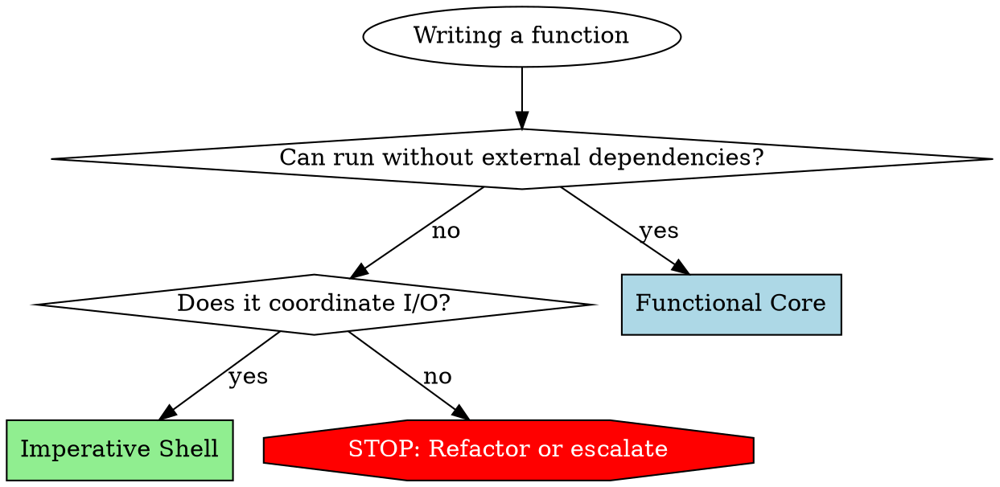

# Functional Core, Imperative Shell (FCIS)

## Overview

**Core principle:** Separate pure business logic (Functional Core) from side effects (Imperative Shell). Pure functions go in one file, I/O operations in another.

**Why this matters:** Pure functions are trivial to test (no mocks needed). I/O code is isolated to thin shells. Bugs become structurally impossible when business logic has no side effects.

## When to Use

**Use FCIS when:**
- Writing any new code file
- Refactoring existing code
- Reviewing code for architectural decisions
- Deciding where logic belongs

**Trigger symptoms:**
- "Where should this function go?"
- Creating a new file
- Adding database calls to logic
- Adding file I/O to calculations
- Writing tests that need complex mocking

## MANDATORY: File Classification

**YOU MUST add pattern comment to every file containing runtime behavior:**

```
// pattern: Functional Core
// pattern: Imperative Shell
// pattern: Mixed (needs refactoring)
```

**If file genuinely cannot be separated (rare), document why:**

```
// pattern: Mixed (unavoidable)
// Reason: [specific technical justification]
// Example: Performance-critical path where separating I/O causes unacceptable overhead
```

**No file with runtime behavior without classification.** If you create a file that contains functions, classes with methods, or orchestration logic without this comment, you have violated the requirement.

### Exempt: Files Without Runtime Behavior

**DO NOT add pattern comments to:**
- **Type-only files** - files exporting only types, interfaces, or type aliases (no runtime code)
- **Constants/enum-like files** - static data declarations, no functions
- **Barrel/index files** - re-exports only (`export * from './foo'`)
- **Test files** - tests exercise core/shell code but aren't themselves core or shell
- **Generated files** - machine-generated code
- Bash/shell scripts (.sh, .bash) - inherently imperative
- Configuration files (eslint.config.js, tsconfig.json, .env, etc.)
- Markdown documentation (.md)
- HTML files (.html)
- Task runner files (justfile, Makefile, etc.)
- Package manifests (package.json, pyproject.toml, etc.)
- Data files (JSON, YAML, CSV, etc.)

**Note:** If an exempt file grows to include runtime logic (e.g., a "types" file gains helper functions, or a constants file gains factory functions), it crosses the threshold and MUST be classified.

**Classification applies to application source files containing runtime behavior** (functions with logic, classes with methods, I/O orchestration).

## File Type Definitions

### Functional Core Files

**Contains ONLY:**
- Pure functions (same input -> same output, always)
- Business logic, validations, calculations, transformations
- Data structure operations

**NEVER contains:**
- File I/O (reading, writing files)
- Database operations (queries, updates, connections)
- HTTP requests or responses
- Environment variable access
- Date.now(), Math.random(), or other non-deterministic functions
- State mutations outside function scope

**Test signature:** Simple assertions, no mocks.

### Imperative Shell Files

**Contains ONLY:**
- I/O operations: file system, database, HTTP, environment
- Orchestration: gather data -> call Functional Core -> persist results
- Error handling for I/O failures
- Minimal business logic (coordination only)

**NEVER contains:**
- Complex calculations
- Business rule validations
- Data transformations beyond format conversion

**Test signature:** Integration tests with real dependencies or test doubles.

## Code Flow Pattern

```
1. GATHER (Shell):  Collect data from external sources
2. PROCESS (Core):  Transform input to output (pure)
3. PERSIST (Shell): Save results externally
```

**Every operation follows this sequence.** No exceptions.

## Decision Framework

Before writing a function, ask:



**Questions to ask:**
- Can this logic run without file system, database, network, or environment?
  - **YES** -> Functional Core
  - **NO** -> Does it coordinate I/O or contain business logic?
    - **I/O coordination** -> Imperative Shell
    - **Business logic + I/O** -> STOP. Refactor or escalate to user.

## Common Mistakes and Rationalizations

| Excuse/Thought Pattern | Reality | What To Do |
|------------------------|---------|------------|
| "Just one file read in this calculation" | File I/O = side effect. Not Functional Core. | Extract to Shell. Pass data as parameter. |
| "Database is passed as parameter, so it's pure" | Database operations are I/O. Not pure. | Move to Shell. Core receives data, not DB connection. |
| "This validation needs to check if file exists" | File system check = I/O. Not Functional Core. | Shell checks file, passes boolean to Core validation. |
| "Small HTTP call, won't hurt" | HTTP = side effect. Breaks purity guarantee. | Shell makes request, Core processes response data. |
| "Need Date.now() for timestamp calculation" | Non-deterministic. Not pure. | Shell passes timestamp as parameter. |
| "This function does both logic and I/O, but it's simpler" | Mixed concerns = untestable without mocks. | Split into Core (logic) + Shell (I/O). Test Core simply. |
| "File classification is overhead" | Prevents entire classes of bugs. Non-negotiable. | Add classification comment. Takes 10 seconds. |
| "I'll refactor later" | Later never comes. Do it now. | Classify and separate now. |
| "Performance requires mixing" | Prove it with benchmarks. Usually wrong. | Separate first. Optimize with evidence. Mark Mixed (unavoidable) with justification. |

## Red Flags - STOP and Refactor

If you catch yourself doing ANY of these, STOP:

- **File I/O in a "pure" function** (open, read, write, exists checks)
- **Database passed as parameter to Functional Core** (queries, updates, connections)
- **HTTP requests in business logic** (fetch, axios, requests)
- **Environment variables in calculations** (process.env, os.getenv)
- **Math.random() or Date.now() in Functional Core** (non-deterministic)
- **Creating a file with runtime behavior without pattern classification comment**
- **Thinking "just this once" about mixing concerns**

**All of these mean:** Extract I/O to Shell. Pass data to Core. Classify file correctly.

## Implementation Patterns

### Functional Core Pattern

```rust
// pattern: Functional Core

pub struct OrderItem { pub price: f64, pub quantity: u32 }
pub struct OrderTotal { pub subtotal: f64, pub tax: f64, pub total: f64 }

pub fn calculate_total_with_tax(items: &[OrderItem], tax_rate: f64) -> OrderTotal {
    let subtotal: f64 = items.iter().map(|i| i.price * i.quantity as f64).sum();
    let tax = subtotal * tax_rate;
    OrderTotal { subtotal, tax, total: subtotal + tax }
}
```

**No I/O. No database. No file system. Only computation.**

### Imperative Shell Pattern

```rust
// pattern: Imperative Shell

pub async fn process_order(order_id: &str, db: &Database) -> anyhow::Result<OrderTotal> {
    // GATHER: Collect data from external sources
    let items = db.get_order_items(order_id).await?;
    let tax_rate = db.get_tax_rate_for_order(order_id).await?;

    // PROCESS: Call Functional Core (pure logic)
    let result = calculate_total_with_tax(&items, tax_rate);

    // PERSIST: Save results externally
    db.update_order_total(order_id, result.total).await?;

    Ok(result)
}
```

**Shell is thin. Core does heavy lifting. Testable separately.**

### Mixed (Needs Refactoring) - Bad Example

```rust
// pattern: Mixed (needs refactoring)

// BAD: Mixes calculation with I/O. Hard to test.
pub async fn calculate_and_save_total(order_id: &str, db: &Database) -> anyhow::Result<f64> {
    let items = db.get_order_items(order_id).await?;                    // I/O
    let subtotal: f64 = items.iter().map(|i| i.price).sum();            // Logic
    let tax_rate = db.get_tax_rate_for_order(order_id).await?;          // I/O
    let tax = subtotal * tax_rate;                                       // Logic
    let total = subtotal + tax;                                          // Logic
    db.update_order_total(order_id, total).await?;                      // I/O
    Ok(total)
}
```

**Testing this requires database mocks. Fragile. Refactor using patterns above.**

## Refactoring Patterns

Common patterns for separating concerns:

### Extract Pure Core from Impure Functions

**Symptom:** Function mixes I/O with logic

```rust
// BEFORE - hard to test
pub async fn process_order(order_id: &str) -> anyhow::Result<()> {
    let order = db::fetch(order_id).await?;             // I/O
    let discount = calculate_discount(&order);           // Pure logic
    let total = apply_discount(&order, discount);        // Pure logic
    db::save(order_id, total).await?;                   // I/O
    Ok(())
}

// AFTER - pure core extracted
pub fn calculate_order_total(order: &Order, rules: &DiscountRules) -> Decimal {
    // Pure function - easy to test
    let discount = calculate_discount(order, rules);
    apply_discount(order, discount)
}

pub async fn process_order(order_id: &str) -> anyhow::Result<()> {
    // Thin I/O wrapper
    let order = db::fetch(order_id).await?;
    let total = calculate_order_total(&order, &get_discount_rules());
    db::save(order_id, total).await?;
    Ok(())
}
```

### Return Values Instead of Mutating

**Symptom:** Methods mutate in place, making before/after comparison hard

```rust
// BEFORE - mutation
pub fn sort_tasks(tasks: &mut Vec<Task>) {
    tasks.sort_by_key(|t| t.priority);
}

// AFTER - returns new value
pub fn sorted_tasks(tasks: &[Task]) -> Vec<Task> {
    let mut result = tasks.to_vec();
    result.sort_by_key(|t| t.priority);
    result
}
```

### Add Missing Inverse Operations

**Symptom:** One-way operation exists but no inverse for testing roundtrips

```rust
// BEFORE - only encode exists
pub fn encode_message(msg: &Message) -> Vec<u8> {
    rmp_serde::to_vec(msg).expect("serialize")
}

// AFTER - add decode for roundtrip testing
pub fn decode_message(data: &[u8]) -> Message {
    rmp_serde::from_slice(data).expect("deserialize")
}
```

### Replace Hardcoded Dependencies

**Symptom:** Functions use globals or hardcoded config, can't test edge cases

```rust
// BEFORE - uses global
pub fn validate_input(data: &str) -> bool {
    data.len() <= CONFIG.max_length
}

// AFTER - dependency injected
pub fn validate_input(data: &str, max_length: usize) -> bool {
    data.len() <= max_length
}
```

### Refactoring Priority

| Pattern | Impact | Effort | Priority |
|---------|--------|--------|----------|
| Extract pure core | HIGH | Medium | Do first |
| Add missing inverse | HIGH | Low | Quick win |
| Return instead of mutate | MEDIUM | Low | Easy improvement |
| Inject dependencies | MEDIUM | Medium | When testing blocked |

## Refactoring Checklist

When you find mixed concerns:

- [ ] Identify pure computations (logic, calculations, validations)
- [ ] Extract pure code to Functional Core file
- [ ] Identify I/O operations (file, database, HTTP, environment)
- [ ] Keep I/O in Imperative Shell file
- [ ] Shell gathers data, calls Core, persists results
- [ ] Add pattern classification comments to both files
- [ ] Test Core with simple assertions, no mocks
- [ ] Test Shell with integration tests

**If you cannot separate:** Escalate to user with specific technical justification. Don't assume mixed is necessary.

## Summary

**FCIS in three rules:**

1. **Functional Core:** Pure functions only. No I/O. Easy to test.
2. **Imperative Shell:** I/O coordination only. Minimal logic. Calls Core.
3. **Classify every file with runtime behavior.** Type-only files, constants, barrels, tests, and generated files are exempt.

**When in doubt:** Can it run without external dependencies? -> Functional Core. Otherwise -> Imperative Shell.

**Mixed concerns = refactoring needed.** Extract, separate, classify. Do it now, not later.
